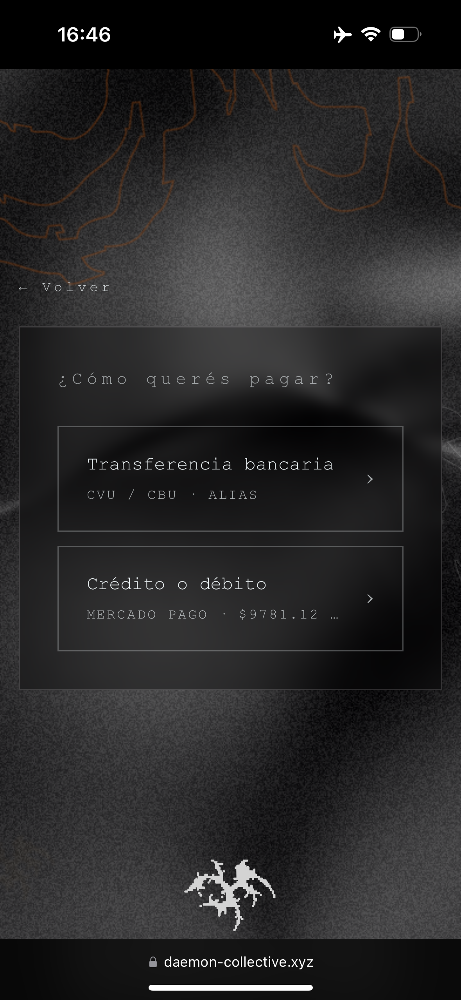
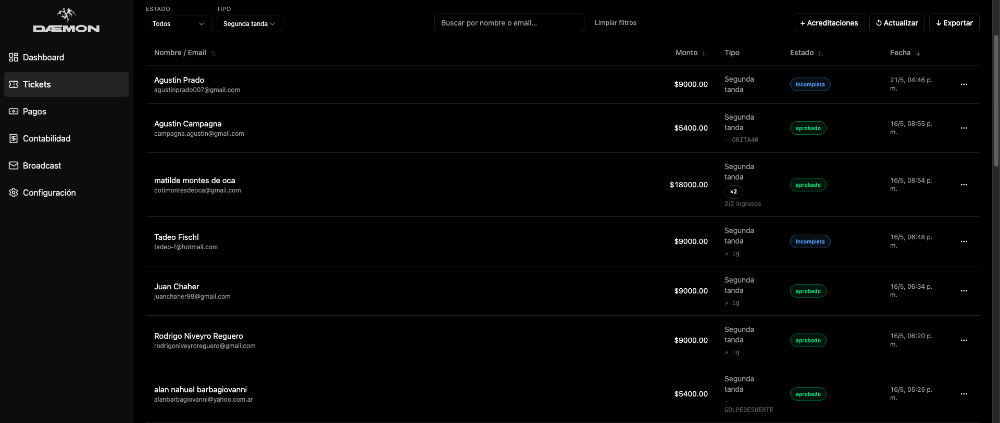
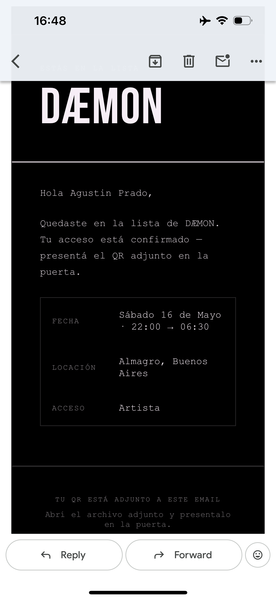

# I run a rave. I also write software. So I built the whole thing myself.

There's a version of this post where I tell you I built a full event platform with AI in one afternoon and it made me a million dollars. That's not this post.

I'm a software developer. I also produce underground electronic music events in Buenos Aires. For DÆMON — the first edition — I used AI throughout the process, as a tool, to go faster and to work in areas where my experience was thinner. The architecture, the decisions, the debugging at midnight before the event: that was mine.

Three hundred thirty-seven tickets sold. The night ran without a single incident.

Here's how it actually worked.

---

## What I built

The project is four surfaces that look very different from the outside but share a single Vite build and a single Vercel deployment:

- A **landing page** with a GLSL shader background and the event brief
- A **Three.js corridor** where visitors navigate through the lineup — artist press photos on the walls
- A **ticketing system** that handles MercadoPago checkout, bank transfer reconciliation, and email delivery
- A **door scanner** for the night itself, with QR scanning and a React admin dashboard behind it

One repo. One `vercel deploy`. Four entry points.

---

## How it grew

It didn't start as a platform. It started as a landing page — just a brief for the event, something to send people to.

Then I added a tickets route. Once that was working, the natural next step was a lineup section. I wanted something more than a list of names. I had some Three.js experience and was exploring ideas, but I also reached out to a 3D designer. Nothing came of it — the work wasn't what I had in mind.

So I went looking on my own and found [spite/cruciform](https://github.com/spite/cruciform), a Three.js architectural visualization by Jaume Sanchez — an open-source "study in architectural visualisation" built around a corridor and a hall OBJ model with baked lighting. It was exactly the kind of space I wanted. I forked it, placed each artist's press photo as a texture on the corridor walls, and suddenly the lineup had a home.

<video src="./media/01-corridor.mp4" controls></video>

*The corridor running — navigate with W or ArrowUp. Each panel is an artist in the lineup.*

Then I realized the same scene could produce the Instagram content. I added a director mode: a scripted camera path that visits each artwork, exporting portrait frames at 1080×1920, 30fps. Run the export, pipe it through FFmpeg, get the reel.

```bash
ffmpeg -framerate 30 -i daemon-director-%04d.png \
  -c:v libx264 -pix_fmt yuv420p -r 30 daemon-director-reel.mp4
```

<video src="./media/02-director-output.mp4" controls></video>

*Director mode exporting frames — same geometry, social media output.*

One scene. Two outputs: the web experience and the social media content.

---

## The homepage background

The corridor was adapted. The homepage background was built from scratch.

It's a GLSL fragment shader running on a full-viewport canvas through [glsl-canvas-js](https://github.com/actarian/glsl-canvas). The visual is driven by 4D Perlin noise — two layered noise fields that warp each other, producing the slow organic movement you see. The fourth dimension of the noise is time, which is what keeps it alive without any geometry or animation loop in the traditional sense.

<video src="./media/03-glsl-background.mp4" controls></video>

*The homepage GLSL background — audio-reactive, pointer-interactive.*

The background is also audio-reactive. Two ambient audio streams run through the Web Audio API, each routed through a pair of biquad filters — a low-pass and a band-pass — whose cutoff frequencies shift based on pointer position and velocity. Move your mouse slowly across the canvas and the texture shifts. Move it fast and the gain spikes briefly. On mobile, where there's no pointer, I built a sinusoidal drift autopilot: the "pointer" orbits continuously at nested frequencies, so the shader stays alive without any user interaction.

Five color palettes. A dat.gui panel for live tweaking. Resolution capping based on browser and DPR to avoid killing mobile GPUs.

It's the thing visitors see first. It sets the tone for the whole night before they read a single word.

---

## The ticketing system

Selling tickets in Argentina has its own character.

MercadoPago is the dominant payment processor, but it doesn't give you clean amounts. If you want the customer to pay exactly $X, you can't just charge $X — the platform takes a 6.6% fee plus 21% IVA on that fee. So you gross up:

```js
const grossedAmount = new Big(amount).div(new Big(1).minus(new Big(0.066).times(1.21)));
```

That gives you what to charge so that after fees, you land on your intended price. All monetary math in the project uses [big.js](https://github.com/MikeMcl/big.js/) — no floating-point arithmetic anywhere near money.


*The ticket purchase flow — bank transfer or card. The shader background runs behind it.*


*MercadoPago checkout — the grossed-up amount ($9.781,12) lands here after the fee calculation.*

Bank transfers add another layer. Many attendees paid via CBU transfer rather than card, and uploaded a photo of their receipt as proof. I ran those receipts through Claude Vision to extract the amount, the transfer date, and the COELSA ID — the unique transaction identifier issued by the Argentine interbank clearing network. The COELSA ID became the idempotency key: if a receipt was submitted twice, we'd catch the duplicate before doing anything with it. The OCR runs fire-and-forget — it doesn't block the order response, it updates the record asynchronously once the analysis comes back.

Webhook verification for MercadoPago payments uses HMAC-SHA256 — the platform sends a signature in a specific format, you reconstruct the manifest from the request body and timestamp, and compare with timing-safe equality. One wrong byte and the webhook is rejected.


*Admin dashboard — order status, entry counts, OCR flags.*


*The ticket email — SVG rendered to PNG server-side, QR code attached.*

---

## The scanner

On the night, we had two people scanning at the door with their phones.

Here's the scenario I was thinking about when I wrote the scanner: a group of four buys a 4-pack ticket. One QR code, four entries. Two scanners working the door simultaneously. Both phones hit the endpoint at the same moment for the same QR.

Without any coordination, both could read `scan_count = 0`, both could decide the ticket is valid, and both could write `scan_count = 1`. You'd let the group through twice.

The fix is in a PostgreSQL function called `scan_order()`. The critical part:

```sql
SELECT * FROM orders WHERE id = order_id FOR UPDATE;
```

`FOR UPDATE` acquires a row-level lock. The second scanner request has to wait until the first one completes. By the time it runs, `scan_count` is already 1. It increments to 2. Both scans register. Nobody gets in twice.

<video src="./media/04-scanner.mp4" controls></video>

*Scanner in action — approval overlay shows the running entry count.*

The scanner UI shows the running count: "2 de 4 entradas". Each scan increments the counter until it hits the total entries for that ticket. After that, the ticket is fully consumed.

We didn't have a single scan issue on the night.

---

## What actually made this possible

The part I want to talk about that doesn't show up in the code: the methodology.

Building all of this solo — across WebGL, Argentine payment rails, PostgreSQL concurrency, React, serverless functions — is only sustainable if you're structured before you touch code. For every feature, I wrote a spec first: what it should do, what the edge cases are, what the scenarios look like. Then a design doc: the key decisions and why. Then a task list. Then implementation.

This is called spec-driven development, and it's the thing I'd recommend most to any solo developer working with AI tooling. AI is genuinely good at accelerating execution. It's less good at telling you what to build or catching the cases you haven't thought of yet. The specs do that. When you hand a well-scoped task to an AI with clear requirements, you get useful output. When you don't, you get plausible-looking code that misses the point.

It also let me work in areas where I had less experience — 3D geometry manipulation, GLSL shaders, payment webhook verification — without getting lost. If you know what you're trying to achieve and can write it down clearly, the gap between "I've done this before" and "I haven't" gets smaller.

---

## The night

I'd sold tickets before. Through platforms that take their cut upfront, hold your money for days or weeks, and charge your audience a service fee on top of the ticket price.

Building it myself meant MercadoPago direct — funds settled the same day. No commission layer. Every order in my own database. Every scan logged against my own records. The data was mine.

Three hundred thirty-seven tickets. A full room. The system ran from the first sale to the last scan without a single issue.

That's what it looks like when a software developer produces their own event.

---

*The Three.js corridor is built on [spite/cruciform](https://github.com/spite/cruciform) by Jaume Sanchez, used under MIT license. Post-processing via [Wagner](https://github.com/spite/Wagner).*
